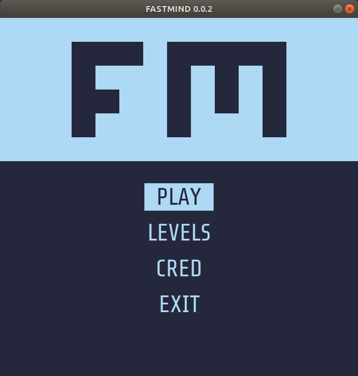
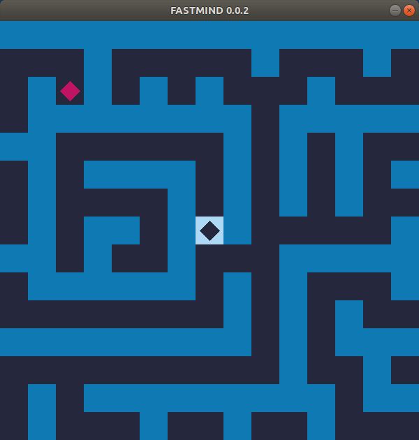

<div align="center">


<br><br>

Solve mazes and measure your time to complete them as fast as you can.

<i>
No habrá nunca una puerta. Estás adentro<br>
y el alcázar abarca el universo<br>
y no tiene ni anverso ni reverso<br>
ni externo muro ni secreto centro.<br><br>
</i>
Fragment of the poem <i>Laberinto</i> of <i>Jorge Luis Borges</i>.




</div>

#  FASTMIND

Solve mazes and measure your time to complete them as fast as you can.

[](https://www.python.org/downloads/release/python-360/)

> No habrá nunca una puerta. Estás adentro\
> y el alcázar abarca el universo\
> y no tiene ni anverso ni reverso\
> ni externo muro ni secreto centro.
>
> Fragment of the poem _Laberinto_ of _Jorge Luis Borges_.


## Requirements

The program uses the __pygame__ library for its full operation, so it is mandatory to install it on your computer before running the program.

> For more questions, go to the official pygame website: https://www.pygame.org/wiki/GettingStarted

### Generic Unix pygame installation

```
python3 -m pip install -U pygame --user
```

> If you do not have pip installed for python3 in Debian/Ubuntu/Mint: `sudo apt-get install python3-pip`

#### Another option for Debian/Ubuntu/Mint

```
sudo apt-get install python3-pygame
```

#### Another option for Fedora/Red Hat

```
sudo yum install python3-pygame
```

### Windows

Make sure you [__install python3.x__](https://www.python.org/downloads/windows/) with the _"Add python 3.x to PATH"_ option selected. This means that python, and pip will work for you from the command line.

```
python -m pip install -U pygame --user
```

## Get and run the program :rocket:

Currently the project is at a very early stage of its development (_alpha_), you can install it on your PC, but future versions may delete previous configurations in the program.

### Assuming you have git installed

```
git clone https://github.com/boot1110001/fastmind
cd fastmind
python3 fastmind.py
```

### Getting a .zip or a .tar.gz file from GitHub

- Extract the `fastmind-x.zip/.tar.gz` in the current folder.
- Open a terminal and navigate to the folder where the content of the `fastmind-x.zip/.tar.gz` has been extracted (using the `cd` command).
- Execute the following command: `python3 fastmind.py`

### Run options

```
python3 fastmind.py --help
fastmind, solve mazes and measure your time...
game options:
 fastmind.py -h			--help			Show this help.
 fastmind.py -l			--list			List the available levels.
 fastmind.py -v			--verbose		Enables verbose mode.
 fastmind.py -p <level_name>	--play=<level_name>	Play the level directly.
```

## Things that I would like to add in the future

- Add more levels.
- Improve the gameplay.
- Rethink the graphics (but keeping the retro style).
- Save the results locally.
- Show results table after each level and be able to compare with others.
- Add teleports.
- Add original music.
- Put the most efficient and understandable code.

## Credits

Created, programmed and maintained by [boot1110001](https://github.com/boot1110001).

## Licenses

- Project under the __[GNU General Public License version 3](https://www.gnu.org/licenses/gpl.txt)__.
- The icons sets are under the __[Creative Commons Attribution 4.0 International](https://creativecommons.org/licenses/by/4.0/)__ (CC BY 4.0) license .

## Donations

- __Bitcoin:__ 37Cx8i8Q4VjJJpMX6oRYVh2FUpXR1yMf54
- __Litecoin:__ MMUTvmaiZhPHjK68Jy1Z9roVFo7siGCcf8
- __Dogecoin:__ DSaqBstRo4h6dpzs9n7UDv39cg9wqErZvo
