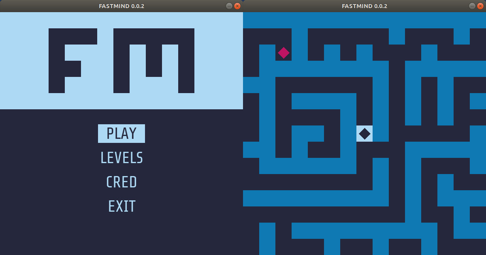

<div align="center">


<br><br>

Solve mazes and measure your time to complete them as fast as you can.

<i>
No habrá nunca una puerta. Estás adentro<br>
y el alcázar abarca el universo<br>
y no tiene ni anverso ni reverso<br>
ni externo muro ni secreto centro.<br><br>
</i>
Fragment of the poem <i>Laberinto</i> of <i>Jorge Luis Borges</i>.
<br><br>



</div>

## Easy installation :smile:

[](https://www.python.org/downloads/release/python-360/)
[](https://www.pygame.org/wiki/GettingStarted)

> If you use __Windows__, you must previously [__install python3.x__](https://www.python.org/downloads/windows/) on your PC.

> In some distributions of __GNU/Linux__ PIP for python3 is not installed by default in the system. If you have this problem run: `sudo apt-get install python3-pip` for Debian/Ubuntu/Mint.

- Get the latest [release](https://github.com/boot1110001/fastmind/releases).
- Extract the `.zip/.tar.gz` in the current folder.
- Open a terminal and navigate to the folder where the content of the `.zip/.tar.gz` has been extracted (using the `cd` command).
- Execute the following command: `sudo python3 setup.py install` for __GNU/Linux__ or `python setup.py install` for __Windows__.

## Manual installation :cold_sweat:

If the easy installation has not worked for you, you can try this.

### Requirements

The program uses the __pygame__ library for its full operation, so it is mandatory to install it on your computer before running the program.

> For more questions, go to the official pygame website: https://www.pygame.org/wiki/GettingStarted

#### Generic Unix pygame installation

```
python3 -m pip install -U pygame --user
```

> If you do not have pip installed for python3 in Debian/Ubuntu/Mint: `sudo apt-get install python3-pip`

##### Another option for Debian/Ubuntu/Mint

```
sudo apt-get install python3-pygame
```

##### Another option for Fedora/Red Hat

```
sudo yum install python3-pygame
```

#### Windows

Make sure you [__install python3.x__](https://www.python.org/downloads/windows/) with the _"Add python 3.x to PATH"_ option selected. This means that python, and pip will work for you from the command line.

```
python -m pip install -U pygame --user
```

### Get and run the program :rocket:

Currently the project is at a very early stage of its development (_alpha_), you can install it on your PC, but future versions may delete previous configurations in the program.

> At the moment this program has not been tested in __Mac OS__, so I still can not specify whether it works or how to install it correctly.

#### Assuming you have git installed

```
git clone https://github.com/boot1110001/fastmind
cd fastmind
python3 fastmind
```

#### Getting a .zip file from GitHub

- Extract the `.zip` in the current folder.
- Open a terminal and navigate to the folder where the content of the `.zip` has been extracted (using the `cd` command).
- Execute the following command: `python3 fastmind` for __GNU/Linux__ or `python fastmind` for __Windows__.

## Run options

```
Usage: fastmind [options]

Options:
  -h, --help            show this help message and exit
  -v, --verbose         print status messages to stdout.
  -l LANG, --lang=LANG  changes the default language.
  -p LEVEL, --play=LEVEL
                        play the LEVEL instantly.
  -s, --show            show the available levels.
```

## Languages avaliable

- __en.EN__ English (UK).
- __es.ES__ Spanish (Spain).
- __es.GL__ Galician.

## Things that I would like to add in the future

- Add more levels.
- Add a configuration section to the main menu.
- Improve the gameplay.
- Rethink the graphics (but keeping the retro style).
- Save the results locally.
- Show results table after each level and be able to compare with others.
- Add teleports.
- Add original music.
- Put the most efficient and understandable code.

## Credits

Created, programmed and maintained by [boot1110001](https://github.com/boot1110001).

## Licenses

[](https://www.gnu.org/licenses/gpl.txt)
[](https://creativecommons.org/licenses/by/4.0/)

- Project under the __[GNU General Public License version 3](https://www.gnu.org/licenses/gpl.txt)__.
- The icons sets are under the __[Creative Commons Attribution 4.0 International](https://creativecommons.org/licenses/by/4.0/)__ (CC BY 4.0) license .

## Donations

- __Bitcoin:__ 37Cx8i8Q4VjJJpMX6oRYVh2FUpXR1yMf54
- __Litecoin:__ MMUTvmaiZhPHjK68Jy1Z9roVFo7siGCcf8
- __Dogecoin:__ DSaqBstRo4h6dpzs9n7UDv39cg9wqErZvo
